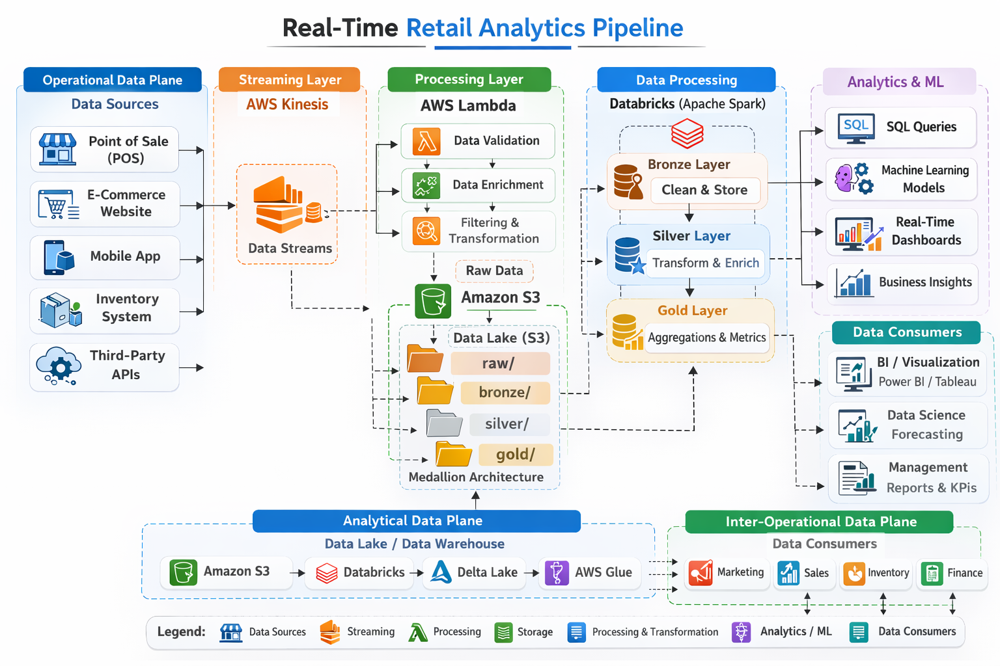

# 🛒 Real-Time Retail Analytics Pipeline

Streaming Retail Insights using AWS Kinesis, Lambda, and Databricks

## 📌 Project Overview

Modern retail businesses need real-time insights to monitor sales, customer behavior, and inventory. This project demonstrates a real-time data engineering pipeline that processes streaming retail transactions and generates analytics-ready datasets.
The pipeline uses AWS streaming services and Databricks for big data processing to transform raw transaction events into structured analytics tables.
This project simulates how companies like Amazon, Walmart, or Flipkart process millions of events in real time.

## 🏗 Architecture Diagram

                   +----------------------+
                   |  Retail POS System   |
                   |  / E-commerce Events |
                   +----------+-----------+
                              |
                              v
                     +------------------+
                     |   AWS Kinesis    |
                     |  Data Streams    |
                     +--------+---------+
                              |
                              v
                   +----------------------+
                   |  AWS Lambda          |
                   |  (Data Validation &  |
                   |   Enrichment Layer)  |
                   +----------+-----------+
                              |
                              v
                     +------------------+
                     |  Amazon S3       |
                     |  Raw Data Lake   |
                     +--------+---------+
                              |
                              v
                 +-------------------------+
                 |  Databricks (Spark)     |
                 |  Streaming Processing   |
                 |  Bronze → Silver → Gold |
                 +-----------+-------------+
                             |
                             v
                   +-------------------+
                   | Analytics Layer   |
                   | Power BI / SQL    |
                   | Dashboards        |
                   +-------------------+

## ⚙️ Tech Stack

| Layer                 | Technology                          |
| --------------------- | ----------------------------------- |
| Data Streaming        | Amazon Kinesis                      |
| Serverless Processing | AWS Lambda                          |
| Data Lake Storage     | Amazon S3                           |
| Big Data Processing   | Databricks (Apache Spark)           |
| Data Transformation   | PySpark                             |
| Infrastructure        | AWS                                 |

## 🔄 Data Pipeline Workflow

### 1. Event Generation (Retail Transactions)

Retail transactions are generated from sources such as:
- Point of Sale systems
- Online purchases
- Mobile apps

### 2. Streaming Layer — AWS Kinesis

The transaction events are streamed into AWS Kinesis Data Streams.

**Responsibilities:**
High-throughput data ingestion
Real-time event streaming
Fault-tolerant event buffering

**Benefits:**
Handles thousands of transactions per second
Ensures low-latency ingestion

### 3. Processing Layer — AWS Lambda
AWS Lambda acts as the real-time processing layer.

**Lambda performs:**
Schema validation
Data cleaning
Adding metadata
Filtering invalid records

### 4. Data Lake — Amazon S3
Amazon S3 stores raw and processed data.
The pipeline follows a multi-layer architecture:

S3
 
 ├── raw/
 
 ├── bronze/
 
 ├── silver/
 
 └── gold/
 

**Raw Layer**
Unprocessed event data directly from Lambda.

**Bronze Layer**
Minimal cleaning and schema enforcement.

**Silver Layer**
Structured and enriched data.

**Gold Layer**
Business-ready datasets for analytics.

### 5. Data Processing — Databricks (Apache Spark)
Databricks reads streaming data from S3 and performs big data transformations.
Using Spark Structured Streaming, it processes data in near real time.

**Silver Layer**
Operations performed:
- Deduplication
- Data normalization
- Enrichment with product metadata

**Gold Layer**
Aggregated metrics such as:
- Total sales per store
- Top-selling products
- Revenue per region
- Hourly transaction trends

## 📊 Analytics Use Cases

The final dataset enables business insights like:

1. **Real-time Sales Dashboard** - Track total revenue per store.
2. **Product Performance** - Identify top-selling products.
3. **Customer Behavior** - Analyze purchase trends.
4. **Inventory Monitoring** - Detect low-stock items.

## 🔐 Scalability Features

This architecture supports:
1. Horizontal scaling with Kinesis shards
2. Serverless compute with Lambda
3. Distributed processing with Spark
4. Highly durable storage using S3
**It can scale to millions of transactions per day.**

## 💡 Future Improvements

Possible enhancements:
1. Add Kafka instead of Kinesis
2. Implement Delta Lake
3. Add ML demand forecasting
4. Real-time fraud detection
5. Deploy infrastructure using Terraform
